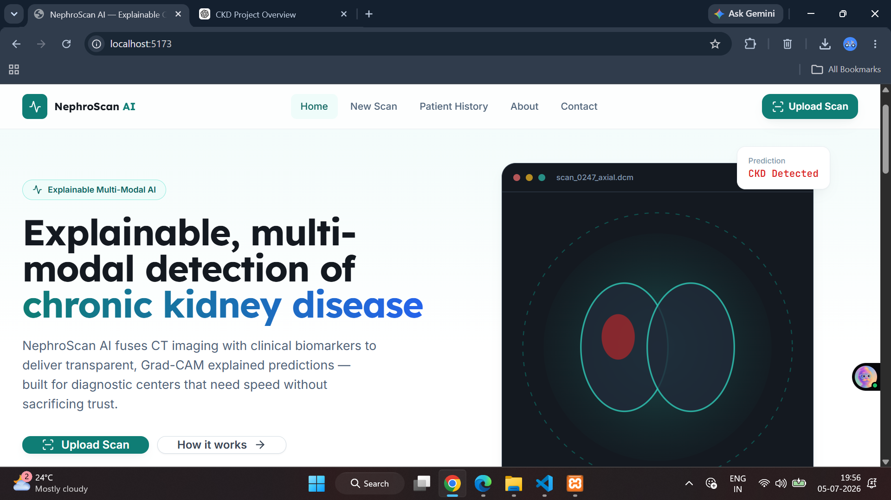
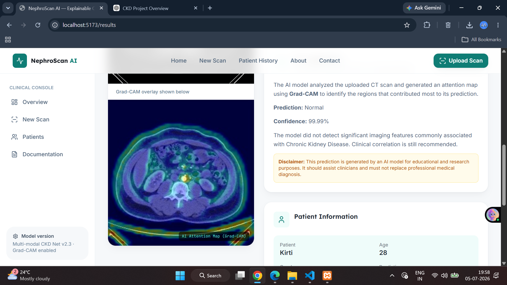
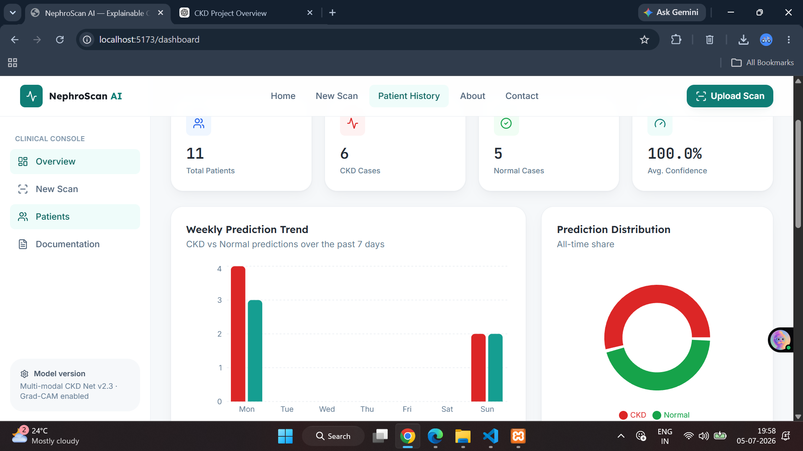
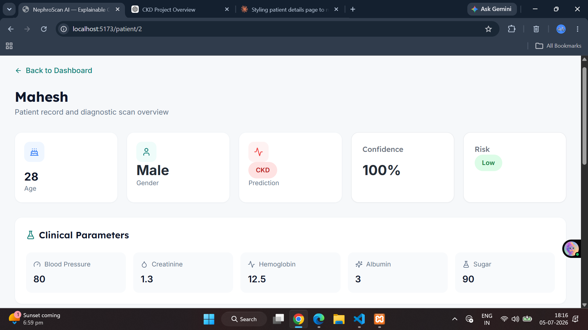

# 🩺 NephroScan AI

An Explainable AI-powered Chronic Kidney Disease (CKD) Detection System using CT Scan images and clinical parameters.


---

## 📖 Overview

NephroScan AI is a web-based clinical decision support system that predicts Chronic Kidney Disease (CKD) from CT scan images using a deep learning model.

The application combines AI prediction with Explainable AI (Grad-CAM) to help users understand why the model made its decision.

---

## ✨ Features

- AI-based CKD Prediction
- Explainable AI using Grad-CAM
- Patient Management Dashboard
- Patient History
- Search & Filter
- PDF Report Generation
- Clinical Parameter Recording
- Confidence Score
- Risk Level Classification
- Responsive User Interface

---

## 🧠 AI Model

- TensorFlow / Keras CNN
- Input Size: 250 × 250
- Classes:
  - Chronic Kidney Disease
  - Normal
- Explainability:
  - Grad-CAM Heatmap

---

## 🛠️ Tech Stack

### Frontend

- React (Vite)
- Tailwind CSS
- Framer Motion
- Lucide React

### Backend

- Flask
- TensorFlow
- OpenCV
- MySQL

### Explainable AI

- Grad-CAM

---

## 📂 Project Structure

```
NephroScan-AI
│
├── backend
│   ├── routes
│   ├── gradcam
│   ├── model
│   ├── utils
│   └── app.py
│
├── src
│
├── public
│
├── package.json
│
└── README.md
```

---

## 🚀 Installation

### Frontend

```bash
npm install
npm run dev
```

### Backend

```bash
cd backend

pip install -r requirements.txt

python app.py
```

---

## 📸 Screenshots

### Home Page



---

### Analysis Results



---

### Patient History



---

### Patient Details



---

### Grad-CAM Heatmap


---

## 🔮 Future Improvements

- Multi-class Kidney Disease Detection
- Cloud Deployment
- Doctor Login
- Patient Authentication
- REST API Documentation
- Model Versioning
- Medical Report Analytics

---

## 👩‍💻 Author

**Pooja Hegde**

MCA Graduate | Software Developer | AI Enthusiast